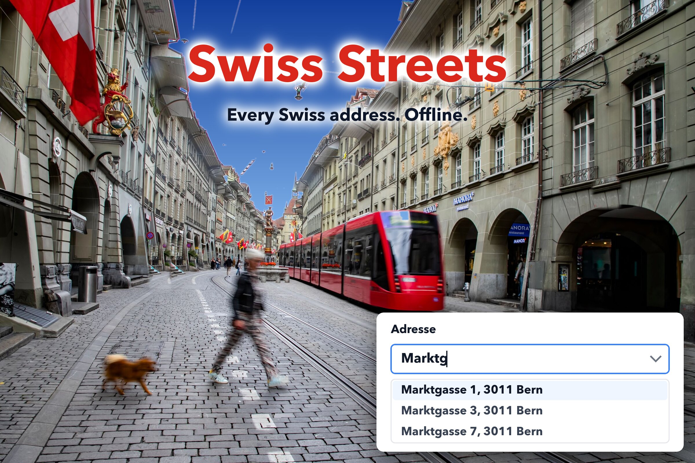

# swissstreets

Every Swiss address. Offline. Daily.



[](https://packagist.org/packages/blemli/swissstreets-for-filament) [](https://github.com/blemli/swissstreets-for-filament/actions?query=workflow%3Atests+branch%3Amain) [](https://github.com/blemli/swissstreets-for-filament/actions?query=workflow%3Afix-code-style+branch%3Amain) [](https://packagist.org/packages/blemli/swissstreets-for-filament)

Address field for Filament backed by the official [Swiss building address register](https://www.swisstopo.admin.ch/en/official-directory-of-building-addresses). Nightly update from the official source, works fully offline, sorts by vicinity — no spatial extension required. Support for foreign addresses, because life is messy.

## Install

```bash
composer require blemli/swissstreets-for-filament
php artisan swissstreets:install
```

The installer schedules the nightly `swissstreets:import` in `routes/console.php` and runs the first import. Transient network errors against swisstopo are retried (2 s / 5 s / 10 s); a failed import exits non-zero and says what to do. A run killed mid-import leaves its lock behind — the next run says who held it since when, heals itself when that process is gone from the same host, or takes `php artisan swissstreets:import --unlock`.

## Use

```php
// Panel
->plugin(SwissstreetsPlugin::make()->cantons(['BS', 'BL'])->table()->notify(User::class))

// Model
class Customer extends Model { use HasAddress; }   // needs an address_id column

// Form: "spalen 113" → Spalenring 113, 4055 Basel
Address::make('address_id')->nonresidential()->nearMe()->allowCustom('address_text')
Address::cascade('address_id')->nearMe()->freetext()   // same, as three selects: town → street → number

// Map picker: search the register or drop the pin anywhere (swisstopo tiles, dark mode aware)
MapPicker::make('location')->lat('latitude')->lng('longitude')->address('address_id')

// Table / infolist
AddressColumn::make('address')->map()
AddressEntry::make('address')->map()

// Query
Address::search('bahnhof zürich')->near($lat, $lng, withinKm: 5)->used()
```

Events: `AddressAdded`, `AddressRemoved`, `AddressRestored` (per address, import or `->freetext()` form) and `ImportFinished` (with the `ImportResult`) under `Blemli\Swissstreets\Events`.

Plugin options: `->cantons([...])` limits the import, `->table()` adds the browsable addresses table to the panel, `->notify(User::class)` (or a closure returning users) sends a database notification after each import that changed something, `->swissgrid()` keeps LV95 easting/northing, `->unofficial()`, `->planned()`, `->health()` registers the health check below. Removed addresses are soft-deleted and logged. Remove everything with `php artisan swissstreets:uninstall`.

## Supported plugins

- [spatie/laravel-health](https://github.com/spatie/laravel-health) (shown in the panel by [shuvroroy/filament-spatie-laravel-health](https://filamentphp.com/plugins/shuvroroy-spatie-laravel-health)): `SwissstreetsPlugin::make()->health()` (or `health.enabled` in the config; the installer offers it when the package is installed) registers the "Swiss address register" check — red when no address was created, updated or removed for 21 days, yellow when the last 3 imports failed. Thresholds: `->health(maxAgeDays: 21, maxFailedRuns: 3)`.
- [spatie/laravel-activitylog](https://github.com/spatie/laravel-activitylog): every added, removed and restored address is recorded as an activity (log name `swissstreets`) when the package is installed; switch off with the `activitylog` config key.

MIT © [blemli](https://github.com/blemli)
